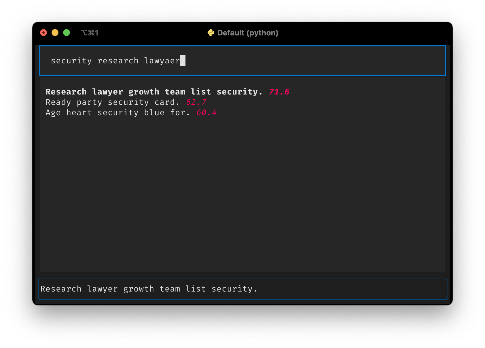

# textual-filter

This project provides a `FilteredOptionList` widget for use in [Textual](https://www.textualize.io) projects. The widget is an extension of the built-in `OptionList` and provides an additional `filter()` method which you can use to filter the list of options based on fuzzy matching using the [RapidFuzz](https://github.com/rapidfuzz/RapidFuzz) package. The list of options will optionally display the score on a 0 - 100 scale (the higher the better).

## What does it look like?



## Example usage

You can simply replace `OptionList` with `FilteredOptionList` in your code. Say you also have an `Input` widget in which you can type your filter query, include the following bit of code to dynamically update your list of options based on the query:
```python
@on(Input.Changed)
def filter_options(self, event: Input.Changed) -> None:
    self.query_one(FilteredOptionList).filter(event.value, show_score=True)
```
That's it!

## Demo

If you install this package, you can run two demos using:
```console
python -m textual_filter.demo
```
and
```console
python -m textual_filter.demo_files
```
